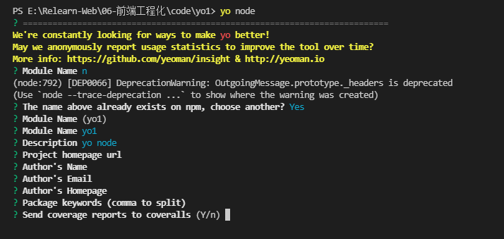
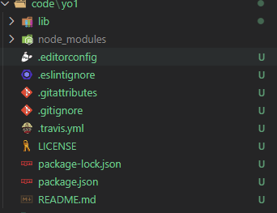

## 什么是脚手架？
`vue-cli` 是 `Vue` 框架官方的一个脚手架，它提供了创建一个基础的 `Vue` 项目，提供了开发规范，集成了一些插件，方便我们直接在该基础项目中直接开发。
可以理解为，脚手架就是帮我们搭建好一个基础项目，我们不需要每次再开发新项目的时候从0开始搭建项目环境。

## 脚手架做到事情
* 相同的组织结构
* 相同的开发范式
* 相同的模块依赖
* 相同的工具配置
* 相同的基础代码
> 脚手架目的就是帮助开发者处理新建项目过程中的一些重复工作，来快速搭建项目骨架。

## IDE集成
通常很多 `IDE` 再创建项目过程中就已经集成脚手架的工作，例如安卓开发工具 `Android Studio`, 或者是 `Flutter` 开发工具。由于前端框架多样性导致并没有很好的集成，通常各种框架都会有对应的 `cli`.

## 常用的脚手架
* `React` 项目有 `create-react-app`
* `Vue` 项目有 `vue-cli`
* `Angular` 项目有 `angular-cli`
> 基本是各自的框架有自己的脚手架工具

## 脚手架做的事情
通过接收用户输入信息来自动创建对应的项目基础结构，创建特定文件,相关的配置。他们特点是只为特定的框架生成项目

## 通用脚手架工具 `Yeoman`
`Yeoman` 用于创建现代化 `Web` 项目的脚手架工具,基于 `node.js` 开发。它的优势是通用性，可以通过创建不同的 `generator` 的方式来定制不同的脚手架。

## `Yeoman` 基本使用

### 全局安装 `yo`
`yarn global add yo`

### 安装 `generator-node`
`generator-node` 是  `Yeoman` 平台已经提供了的一个用于创建 `node.js` 脚手架的 `generator`。我们可以直接使用它来创建我们的项目。
`yarn global add generator-node`

### 创建脚手架
在 `yo1` 目录中执行：   
`yo node` 使用已经安装的 `generator-node`   
* 是否同意上报数据,随意填写 `n`   
      
* 提示该模块名字在 `npm` 网站中已经存在，是否继续使用 `Yes`   
     
* 其他就是按提示填写，模块描述，作者，关键字，首页，支持的 `node.js` 版本，协议信息等   
     
     
* 完了之后最终会目录中多出了这么多文件   
  

> 以上就是脚手架的工作流程

## `Yeoman` 流程总结
首先在全局安装 `Yeoman` 包 `yo`, 接着安装对应的 `generator`, 不同项目有不同的 `generator` , 使用 `yo` 来运行已经安装的 `generator`，通过命令行交互的方式输出一些项目配置内容来完成项目接口创建。

## 自定义 `generator`
除了使用平台提供的 `generator`, 我们也可以开发自己的 `generator` 来实现个性化的脚手架。

### 创建 `generator`
创建生成器目录:   
```
generators
│  package.json
│  yarn-error.log
│
├─app // 默认生成器 `generator`
│   index.js
│
└─node-app // 其他生成器 `generator`
    index.js

```

### 命名要求
`generator` 名称必须以 `generator-<name>` 命名，否则无法找到对应的 `generator`.